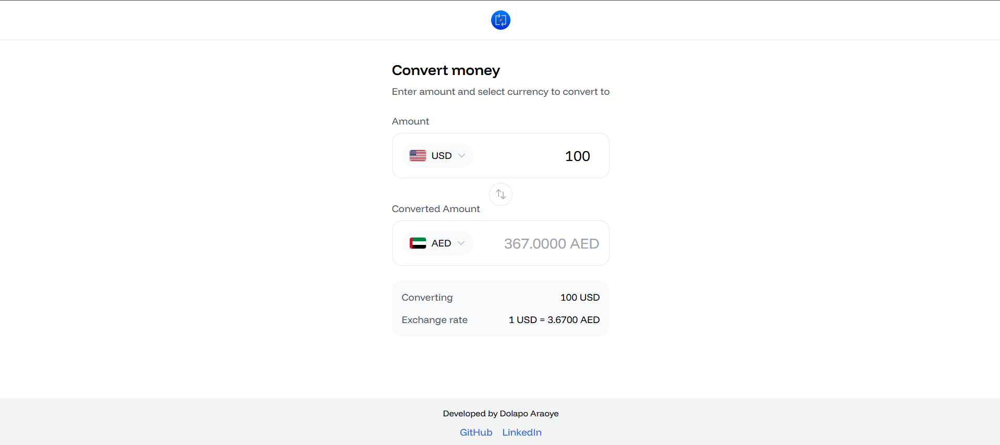

# Currency Exchange App

## Overview

The Currency Exchange App is a user-friendly web application designed to facilitate real-time currency conversion. Users can easily convert amounts between different currencies, view exchange rates, and select from a variety of available currencies. The app fetches live data from a currency exchange API, ensuring that users have access to the most accurate and up-to-date information.

## Features

- **Real-Time Currency Conversion**: Convert amounts between different currencies with live exchange rates.
- **User-Friendly Interface**: Intuitive design that allows users to easily input amounts and select currencies.
- **Error Handling**: Displays error messages when there are issues connecting to the server or fetching data.
- **Responsive Design**: Optimized for both desktop and mobile devices.

## Technologies Used

- **React**: A JavaScript library for building user interfaces.
- **Tailwind CSS**: A utility-first CSS framework for styling the application.
- **Currency Exchange API**: Fetches live exchange rates for various currencies.

## Home Page



## Installation

To run the Currency Exchange App locally, follow these steps:

1. Clone the repository:
   ```bash
   git clone https://github.com/your-username/currency-exchange-app.git
   ```
2. Navigate to the project directory:
   ```bash
   cd currency-exchange-app
   ```
3. Install the dependencies:
   ```bash
   npm install
   ```
4. Start the development server:
   ```bash
   npm start
   ```

## Usage

Once the app is running, you can:

- Enter an amount in the input field.
- Select the currency you want to convert from and to.
- View the converted amount and the exchange rate.

## Contributing

Contributions are welcome! If you have suggestions for improvements or new features, feel free to open an issue or submit a pull request.

## License

This project is licensed under the MIT License - see the [LICENSE](LICENSE) file for details.

## Author

Developed by Dolapo Araoye
